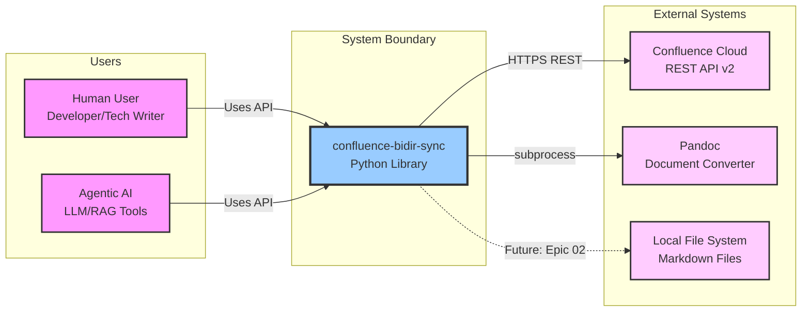

# Architecture - Context & Scope

---

## System Context (C4 Level 1)

### Context Diagram



### External Interfaces

| External Entity | Type | Relationship | Protocol/Interface |
|----------------|------|--------------|-------------------|
| **Confluence Cloud** | External Service | Bidirectional CRUD | HTTPS REST API v2 |
| **Pandoc** | Local Tool | Format conversion | subprocess stdin/stdout |
| **Local File System** | Storage | Read/write markdown (Epic 02) | Python file I/O |
| **Human User** | Actor | Invokes library functions | Python API |
| **Agentic AI** | Actor | Programmatic page manipulation | Python API |

## Business Context

### Input/Output

**Inputs**:
- Confluence page ID or space/title path
- Markdown content for create/update operations
- API credentials (URL, email, token) from `.env`
- Surgical operations (UPDATE_TEXT, DELETE_BLOCK, etc.)

**Outputs**:
- `PageSnapshot`: XHTML + markdown + version + metadata
- `UpdateResult`: Success status, new version, error details
- `CreateResult`: Page ID, version, success status
- Typed exceptions with actionable error messages

### Primary Use Cases

| Use Case | Actor | Flow |
|----------|-------|------|
| **Fetch as Markdown** | Agent/User | Request page → API fetch → XHTML → Pandoc → Markdown |
| **Surgical Update** | Agent | Provide operations → Apply to XHTML → Upload → Verify |
| **Create Page** | Agent/User | Markdown → XHTML → API create → Return page ID |
| **Detect Conflicts** | System | Compare versions → Fail if mismatch → Clear error |

## Technical Context

| Channel | Protocol | Data Format | Security |
|---------|----------|-------------|----------|
| Confluence API | HTTPS REST | JSON (XHTML in body.storage) | API Token + TLS 1.3 |
| Pandoc | subprocess | stdin/stdout (text) | Local only, no shell |
| Credentials | Environment | .env file | Never logged |

### Authentication Flow

```
.env file
    │
    ▼
Authenticator.load()
    │
    ▼
Credentials(url, email, token)
    │
    ▼
atlassian-python-api Confluence client
    │
    ▼
HTTP Basic Auth over HTTPS
```

---
