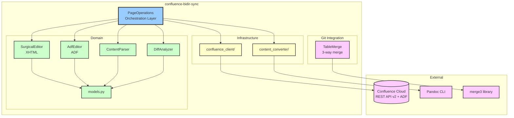
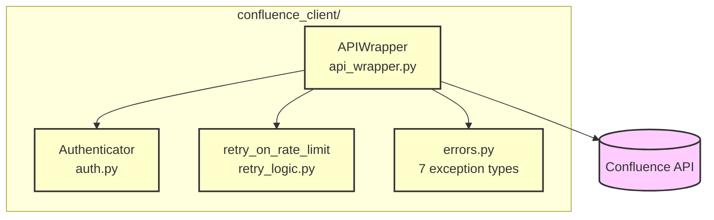
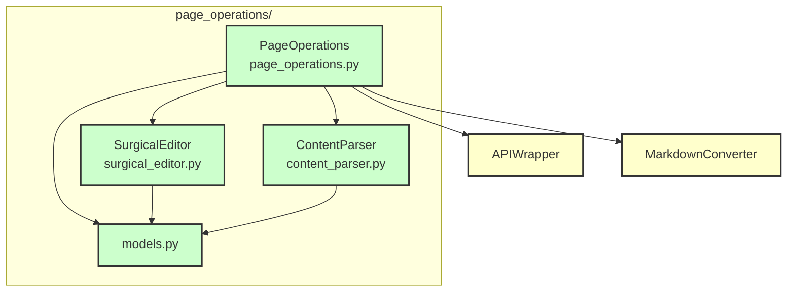

# Architecture - Building Block View

---

## Container View (C4 Level 2)

### Container Diagram



### Containers

| Container | Technology | Responsibility |
|-----------|-----------|----------------|
| `page_operations/` | Python | Orchestrates read/write/create; surgical editing; content parsing |
| `confluence_client/` | Python + atlassian-python-api | API authentication, HTTP client, error handling, retry logic |
| `content_converter/` | Python + Pandoc subprocess | Bidirectional XHTML↔markdown conversion |
| `models/` | Python dataclasses | Shared data structures |

## Component View (C4 Level 3)

### confluence_client/ Components



#### Component: Authenticator (`auth.py`)

**Responsibility**: Load and validate Confluence credentials from environment

**Dependencies**: python-dotenv

**Interfaces**:
- `Authenticator()` - Constructor, loads from `.env`
- `Authenticator.url` - Confluence instance URL
- `Authenticator.email` - User email
- `Authenticator.api_token` - API token

**Security**: Never logs credentials; validates all required fields present

#### Component: APIWrapper (`api_wrapper.py`)

**Responsibility**: Wrap Confluence REST API with error translation and retry logic

**Dependencies**: atlassian-python-api, Authenticator, errors.py, retry_logic.py

**Interfaces**:
```python
get_page_by_id(page_id: str, expand: str = "") -> dict
get_page_by_title(space: str, title: str, expand: str = "") -> Optional[dict]
get_child_pages(page_id: str, expand: str = "") -> List[dict]
create_page(space: str, title: str, body: str, parent_id: Optional[str]) -> dict
update_page(page_id: str, title: str, body: str, version: int) -> dict
delete_page(page_id: str) -> None
```

#### Component: retry_logic (`retry_logic.py`)

**Responsibility**: Exponential backoff retry for 429 rate limits only

**Interfaces**:
```python
retry_on_rate_limit(func: Callable, *args, **kwargs) -> Any
@as_decorator  # Decorator form
```

**Behavior**: 1s → 2s → 4s backoff; max 3 retries; fail-fast for non-429 errors

#### Component: errors (`errors.py`)

**Responsibility**: Typed exception hierarchy for precise error handling

**Exception Hierarchy**:
```
ConfluenceError (base)
├── InvalidCredentialsError(user, endpoint)
├── PageNotFoundError(page_id)
├── PageAlreadyExistsError(title, parent_id)
├── VersionConflictError(page_id, expected, actual)
├── APIUnreachableError(endpoint)
├── APIAccessError(message)
└── ConversionError(message)
```

### page_operations/ Components



#### Component: PageOperations (`page_operations.py`)

**Responsibility**: High-level orchestration for page read/write/create with dual update paths

**Dependencies**: APIWrapper, MarkdownConverter, SurgicalEditor, ContentParser, AdfEditor, AdfParser, DiffAnalyzer

**Interfaces**:
```python
get_page_snapshot(page_id: str, version: Optional[int] = None) -> PageSnapshot
get_page_versions(page_id: str) -> List[PageVersion]
apply_operations(page_id: str, base_xhtml: str, base_version: int,
                 operations: List[SurgicalOperation]) -> UpdateResult
create_page(space_key: str, title: str, markdown: str,
            parent_id: Optional[str] = None, check_duplicate: bool = True) -> CreateResult

# NEW: ADF-based surgical updates
update_page_surgical_adf(page_id: str, new_markdown: str,
                         baseline_markdown: str = None) -> AdfUpdateResult
```

**Update Paths**:
1. **XHTML Surgical** (`apply_operations`): Position-signature based targeting
2. **ADF Surgical** (`update_page_surgical_adf`): localId-based targeting (preferred)
   - Uses baseline-centric diffing (baseline vs. new markdown)
   - Falls back to full replacement if >50% operations fail

#### Component: SurgicalEditor (`surgical_editor.py`)

**Responsibility**: Apply discrete operations to XHTML without touching macros

**Dependencies**: BeautifulSoup4, lxml, models.py

**Interfaces**:
```python
apply(xhtml: str, operations: List[SurgicalOperation]) -> str
count_macros(xhtml: str) -> int
```

**Supported Operations**:
- `UPDATE_TEXT` - Replace text within elements
- `DELETE_BLOCK` - Remove paragraphs, headings, list items
- `INSERT_BLOCK` - Add new block elements
- `CHANGE_HEADING_LEVEL` - Modify h1-h6 tags
- `TABLE_INSERT_ROW` - Add table rows
- `TABLE_DELETE_ROW` - Remove table rows
- `TABLE_UPDATE_CELL` - Update specific table cell

**Key Constraint**: NEVER modifies elements with `ac:` namespace prefix

#### Component: AdfEditor (`adf_editor.py`)

**Responsibility**: Surgical editing of ADF documents via localId targeting

**Dependencies**: AdfParser, AdfModels

**Interfaces**:
```python
apply_operations(adf_doc: AdfDocument, operations: List[SurgicalOperation],
                 local_id_map: Dict[str, str]) -> Tuple[AdfDocument, int, int]
count_macros(doc: AdfDocument) -> int
```

**Key Design**:
- Targets nodes by `localId` attribute (stable identifier)
- Converts `<br>` tags to `hardBreak` ADF nodes
- Falls back to content matching if localId unavailable
- Never modifies macro nodes (extension types)

#### Component: AdfParser (`adf_parser.py`)

**Responsibility**: Parse ADF JSON into typed object model

**Dependencies**: AdfModels

**Interfaces**:
```python
parse_document(adf_json: dict) -> AdfDocument
extract_blocks(doc: AdfDocument) -> List[AdfBlock]
```

#### Component: AdfModels (`adf_models.py`)

**Responsibility**: Data classes for ADF document structure

**Key Classes**:
```python
class AdfDocument:     # Root document with version and content
class AdfNode:         # Node with type, content, text, attrs, marks
class AdfBlock:        # Extracted block for diff analysis
class AdfOperation:    # Surgical operation targeting localId
class AdfUpdateResult: # Result with success, versions, operation counts
```

#### Component: DiffAnalyzer (`diff_analyzer.py`)

**Responsibility**: Generate surgical operations from content comparison

**Dependencies**: models.py

**Interfaces**:
```python
analyze(old_blocks: List[ContentBlock], new_blocks: List[ContentBlock]) -> List[SurgicalOperation]
```

**Key Design**:
- Compares baseline vs. new content (same format = no parser mismatch)
- Generates minimal operation set for detected changes
- Handles tables, headings, paragraphs, lists

#### Component: MacroPreserver (`macro_preserver.py`)

**Responsibility**: Protect Confluence macros during surgical edits

**Interfaces**:
```python
count_inline_comments(xhtml: str) -> int
extract_macros(xhtml: str) -> List[MacroInfo]
```

#### Component: ContentParser (`content_parser.py`)

**Responsibility**: Extract content blocks from XHTML for analysis

**Dependencies**: BeautifulSoup4, lxml, models.py

**Interfaces**:
```python
parse(xhtml: str) -> BeautifulSoup
extract_blocks(xhtml: str) -> List[ContentBlock]
```

**Block Types**: HEADING, PARAGRAPH, TABLE, LIST, CODE, MACRO, OTHER

#### Component: models (`models.py`)

**Responsibility**: Data classes for page operations domain

**Data Classes**:
```python
@dataclass
class PageSnapshot:
    page_id: str
    space_key: str
    title: str
    xhtml: str           # Original XHTML (reference for surgical updates)
    markdown: str        # Converted markdown (for agents/diff)
    version: int         # For optimistic locking
    parent_id: Optional[str]
    labels: List[str]

@dataclass
class SurgicalOperation:
    op_type: OperationType
    target_content: str
    new_content: str
    old_level: int = 0   # For heading changes
    new_level: int = 0
    row_index: int = 0   # For table operations

class OperationType(Enum):
    UPDATE_TEXT, DELETE_BLOCK, INSERT_BLOCK,
    CHANGE_HEADING_LEVEL, TABLE_INSERT_ROW, TABLE_DELETE_ROW

@dataclass
class UpdateResult:
    success: bool
    old_version: int
    new_version: int
    error: Optional[str]

@dataclass
class CreateResult:
    success: bool
    page_id: Optional[str]
    version: Optional[int]
    error: Optional[str]
```

### content_converter/ Components

#### Component: MarkdownConverter (`markdown_converter.py`)

**Responsibility**: Bidirectional XHTML↔markdown conversion with table-aware handling

**Dependencies**: markdownify (HTML→markdown), Pandoc CLI (markdown→HTML)

**Interfaces**:
```python
xhtml_to_markdown(xhtml: str) -> str  # Uses markdownify for clean pipe tables
markdown_to_xhtml(markdown: str) -> str  # Uses Pandoc + post-processing
```

**Implementation**:
- **HTML→Markdown**: Custom markdownify converter with Confluence-friendly settings
  - Preserves `<br>` tags in table cells for multi-line content
  - Converts Confluence `<p>` tags in cells to `<br>` markers
  - Produces clean pipe tables (`| col1 | col2 |`)
- **Markdown→HTML**: Pandoc subprocess + post-processing
  - Converts `<br>` in cells back to `<p>` tags (Confluence format)
  - 10-second timeout; no `shell=True`

---

### git_integration/ Components

#### Component: TableMerge (`table_merge.py`)

**Responsibility**: Cell-level 3-way merge for markdown tables

**Dependencies**: merge3 library

**Interfaces**:
```python
merge_content_with_table_awareness(base: str, local: str, remote: str) -> Tuple[str, bool]
find_tables(content: str) -> List[TableRegion]
normalize_table_for_merge(table: TableRegion) -> List[str]
denormalize_table(lines: List[str]) -> str
```

**Key Design**:
- Tables are normalized to cell-per-line format with unique context markers
- Each cell becomes: `__CELL_START__|row|col|` + content + `__CELL_END__|row|col|`
- Allows merge3 to auto-merge changes to different cells in same row
- Newlines in cells are escaped (`__CELL_NEWLINE__`) to preserve through merge

**Supported Operations**:
- Changes to different cells in same row → auto-merge
- Changes to different rows → auto-merge
- Changes to same cell on both sides → conflict

---
