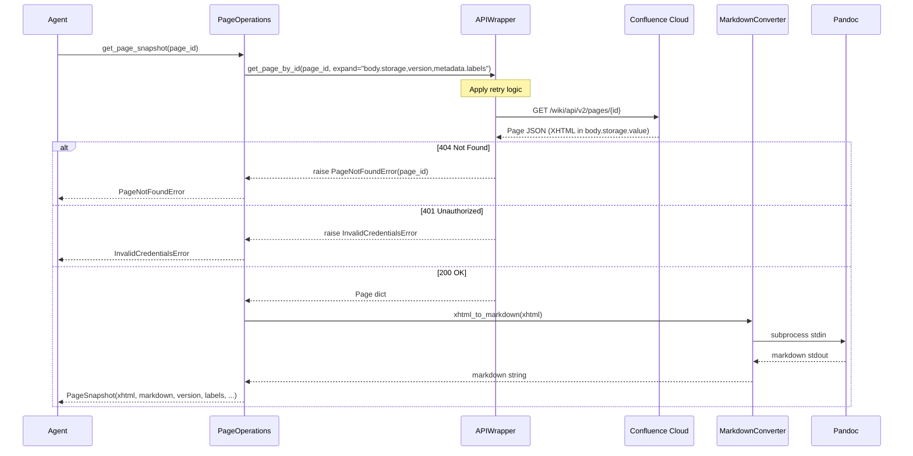
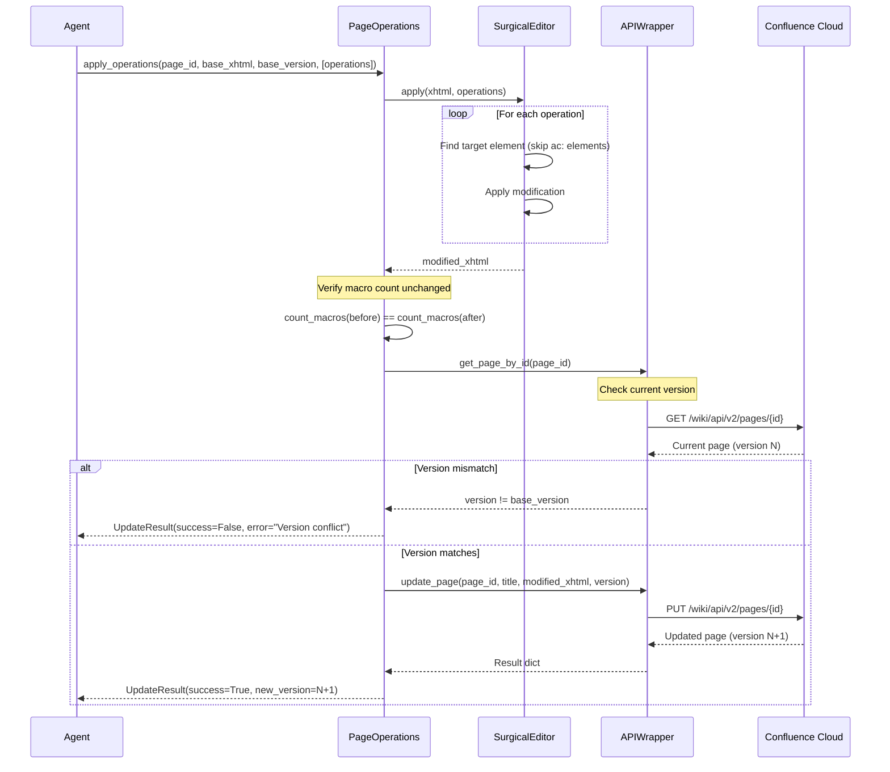
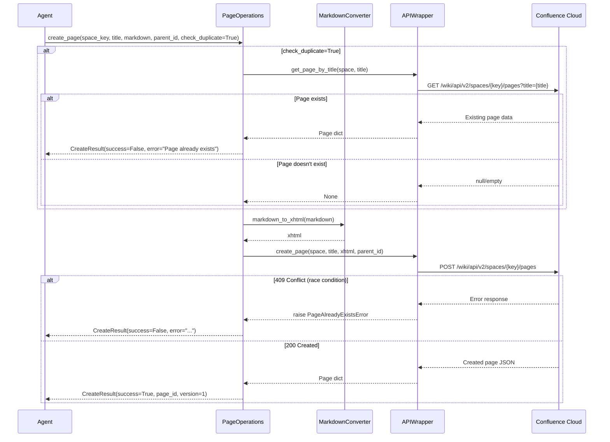
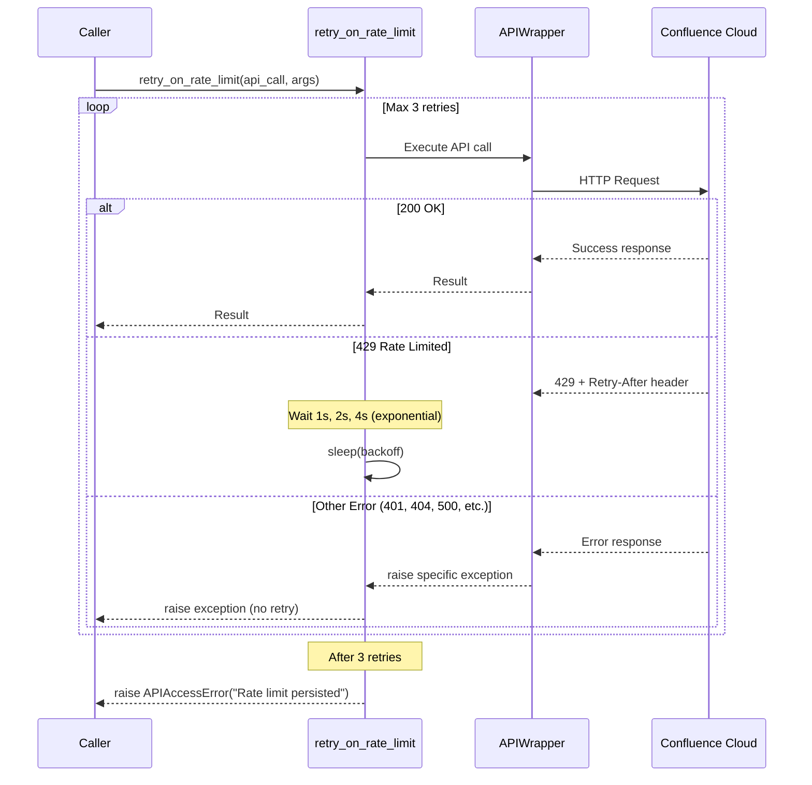
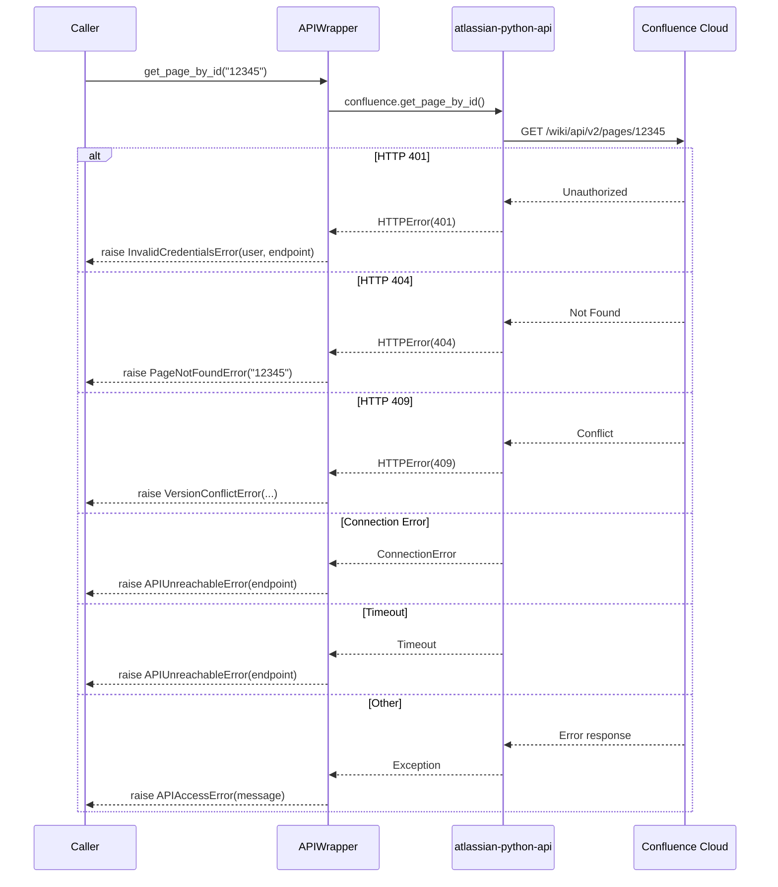
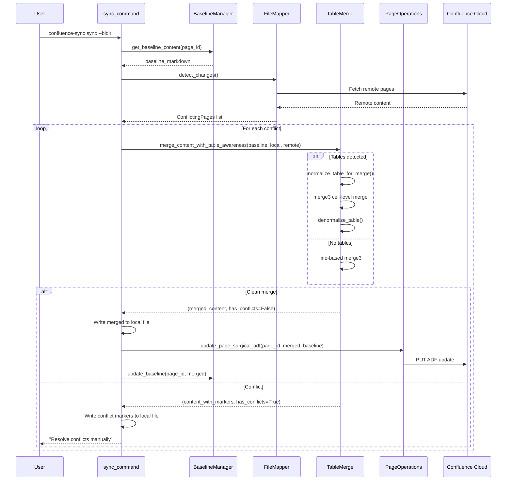
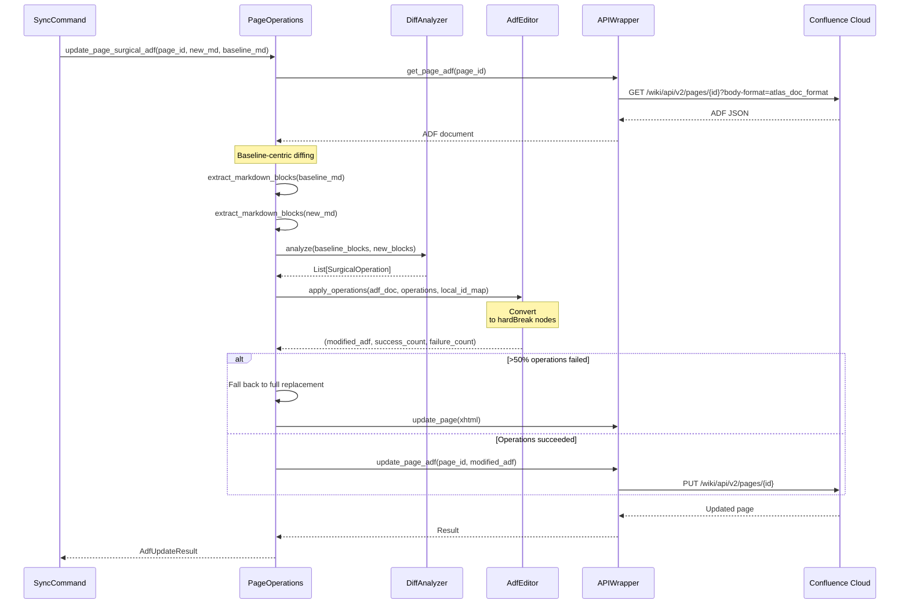

# Architecture - Runtime View

---

## Key Runtime Scenarios

### Scenario 1: Get Page Snapshot

**Actor**: Agentic AI or Human User
**Goal**: Fetch a Confluence page with both XHTML (for surgical updates) and markdown (for editing)

**Key Points**:
- XHTML is preserved as-is for surgical updates
- Markdown is for human/agent editing
- Version number captured for optimistic locking

---

### Scenario 2: Apply Surgical Operations

**Actor**: Agentic AI
**Goal**: Modify specific content without corrupting macros or formatting

**Key Points**:
- Surgical editor NEVER modifies `ac:` namespace elements
- Version check before upload prevents silent overwrites
- Macro count verification ensures preservation

---

### Scenario 3: Create New Page

**Actor**: Agentic AI or Human User
**Goal**: Create a Confluence page from markdown content

**Key Points**:
- Optional duplicate detection before create attempt
- Handles race condition via API error
- Returns page_id for subsequent operations

---

### Scenario 4: Rate Limit Handling

**Actor**: System (during any API call)
**Goal**: Automatically retry on 429 without user intervention

**Key Points**:
- Only 429 responses trigger retry
- Exponential backoff: 1s → 2s → 4s
- Other errors fail immediately (fail-fast)
- Respects Retry-After header when present

---

### Scenario 5: Error Translation

**Actor**: System (in APIWrapper)
**Goal**: Convert HTTP/API errors to typed exceptions

**Key Points**:
- Each HTTP status maps to a specific exception type
- Exceptions include context (page_id, endpoint, user)
- Enables precise error handling by callers

---

### Scenario 6: Bidirectional Sync with 3-Way Merge

**Actor**: CLI User
**Goal**: Synchronize local markdown files with Confluence, handling concurrent edits

**Key Points**:
- Baseline is the source of truth for 3-way merge
- Table-aware merge handles cell-level changes in same row
- Auto-merged content is pushed to Confluence and baseline updated
- Conflicts require manual resolution

---

### Scenario 7: ADF Surgical Update with Baseline Diffing

**Actor**: Sync Command
**Goal**: Update Confluence page using ADF with precise diffing

**Key Points**:
- Diff is baseline vs. new markdown (same format = no parser mismatch)
- ADF operations target nodes by localId (stable identifier)
- ` ` tags in markdown become `hardBreak` ADF nodes
- Falls back to full replacement if surgical operations fail

---
