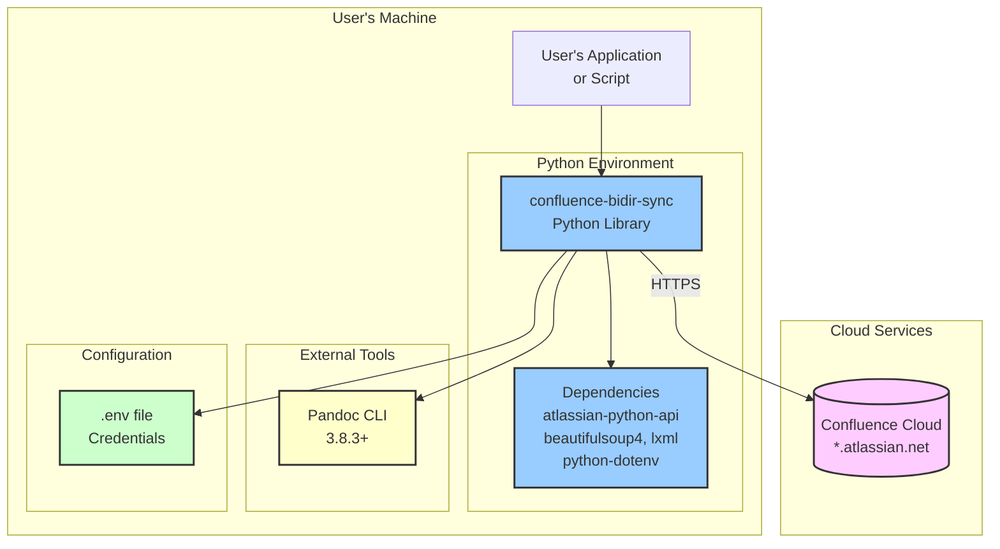

# Architecture - Deployment View

---

## Deployment Model

**confluence-bidir-sync** is a Python library distributed via git clone, not a deployed service. It runs locally on the user's machine.

### Deployment Diagram



## Installation

### Prerequisites

| Prerequisite | Version | Installation |
|-------------|---------|--------------|
| Python | 3.9+ | System package or pyenv |
| Pandoc | 3.8.3+ | `brew install pandoc` (macOS) or system package |
| Git | Any | System package |

### Installation Steps

```bash
# 1. Clone repository
git clone https://github.com/your-org/confluence-bidir-sync.git
cd confluence-bidir-sync

# 2. Create virtual environment
python3.9 -m venv .venv
source .venv/bin/activate  # Linux/macOS
# or: .venv\Scripts\activate  # Windows

# 3. Install dependencies
pip install -r requirements.txt

# 4. Install test dependencies (for development)
pip install -r requirements-test.txt

# 5. Create .env file
cp .env.example .env
# Edit .env with your credentials
```

### Configuration

**Required Environment Variables** (in `.env`):

```bash
CONFLUENCE_URL=https://your-instance.atlassian.net/wiki
CONFLUENCE_USER=your-email@company.com
CONFLUENCE_API_TOKEN=your-api-token-here
```

**Test Environment** (in `.env.test`):

```bash
CONFLUENCE_TEST_URL=https://test-instance.atlassian.net/wiki
CONFLUENCE_TEST_USER=test-email@company.com
CONFLUENCE_TEST_API_TOKEN=test-api-token
CONFLUENCE_TEST_SPACE=CONFSYNCTEST
```

## Runtime Environment

### System Requirements

| Resource | Minimum | Recommended |
|----------|---------|-------------|
| Memory | 256 MB | 512 MB |
| Disk | 100 MB | 500 MB |
| Network | HTTPS outbound | HTTPS outbound |
| CPU | 1 core | 2+ cores |

### Dependencies Version Matrix

| Dependency | Minimum | Tested | Notes |
|------------|---------|--------|-------|
| Python | 3.9 | 3.12 | Type hints require 3.9+ |
| Pandoc | 3.0 | 3.8.3 | Subprocess invocation |
| atlassian-python-api | 4.0.0 | 4.0.7 | REST API v2 |
| BeautifulSoup4 | 4.12 | 4.14.3 | XHTML parsing |
| lxml | 5.0 | 5.3.0 | XML namespace support |

### Network Requirements

| Destination | Protocol | Port | Purpose |
|-------------|----------|------|---------|
| *.atlassian.net | HTTPS | 443 | Confluence Cloud API |

**Firewall Rules**: Outbound HTTPS to Atlassian cloud required.

## Development Environment

### IDE Setup

**VS Code** (recommended):
```json
// .vscode/settings.json
{
    "python.defaultInterpreterPath": ".venv/bin/python",
    "python.linting.enabled": true,
    "python.linting.mypyEnabled": true,
    "python.linting.ruffEnabled": true
}
```

### Test Execution

```bash
# All tests (requires Confluence access for E2E)
pytest

# Unit tests only (fast, no external deps)
pytest tests/unit/

# E2E tests only (requires Confluence)
pytest tests/e2e/

# With coverage
pytest --cov=src --cov-report=html
```

## Future: CI/CD Pipeline (Planned)

```yaml
# .github/workflows/test.yml (future)
name: Tests
on: [push, pull_request]
jobs:
  unit-tests:
    runs-on: ubuntu-latest
    steps:
      - uses: actions/checkout@v4
      - uses: actions/setup-python@v5
        with:
          python-version: '3.9'
      - run: pip install -r requirements.txt -r requirements-test.txt
      - run: pytest tests/unit/ --cov=src

  e2e-tests:
    runs-on: ubuntu-latest
    # Only on main branch, requires secrets
    if: github.ref == 'refs/heads/main'
    steps:
      - uses: actions/checkout@v4
      - uses: pandoc/actions/setup@v1
      - uses: actions/setup-python@v5
        with:
          python-version: '3.9'
      - run: pip install -r requirements.txt -r requirements-test.txt
      - run: pytest tests/e2e/
        env:
          CONFLUENCE_URL: ${{ secrets.CONFLUENCE_URL }}
          CONFLUENCE_USER: ${{ secrets.CONFLUENCE_USER }}
          CONFLUENCE_API_TOKEN: ${{ secrets.CONFLUENCE_API_TOKEN }}
```

---
