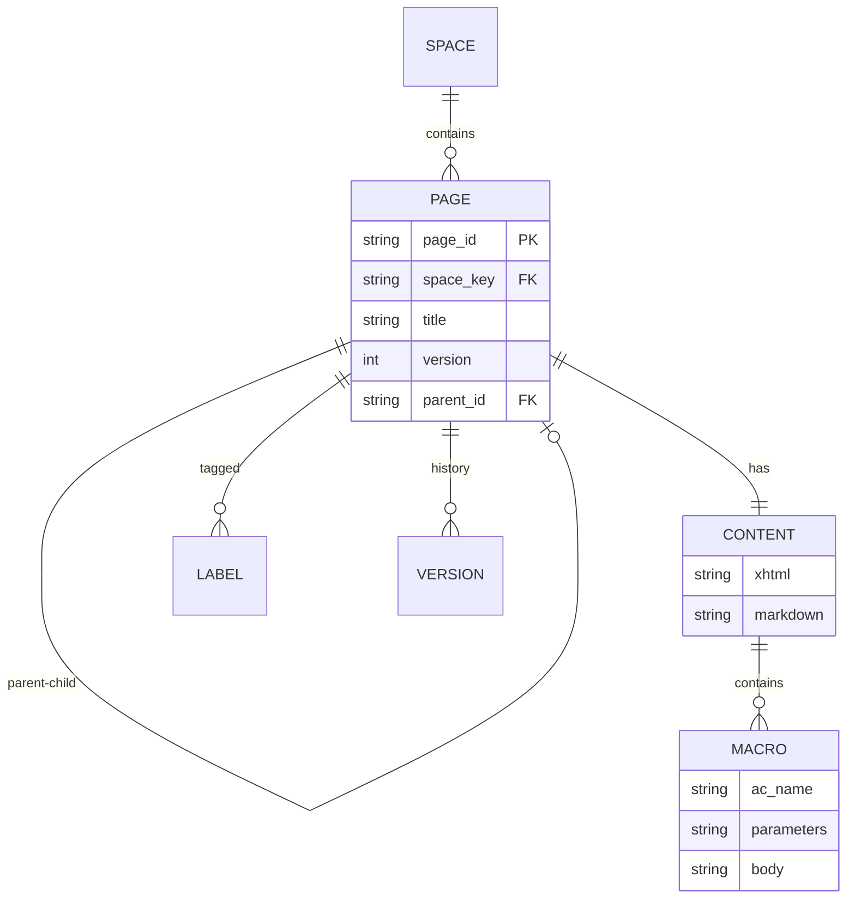

# Cross-Cutting - Domain Concepts

---

## Domain Entities

### Core Entities

| Entity | Description | Key Attributes |
|--------|-------------|----------------|
| **Page** | Confluence page with content and metadata | page_id, space_key, title, version, parent_id |
| **Content** | Page body in storage format (XHTML or ADF) | xhtml, adf_json, macros, local_ids |
| **Macro** | Confluence extension element (`ac:` namespace) | name, parameters, body |
| **Operation** | Discrete change to apply to content | op_type, target_content, new_content, target_local_id |
| **Baseline** | Last synced content (source of truth for merge) | page_id, markdown_content, timestamp |
| **TableRegion** | Markdown table with position and parsed content | start_line, end_line, header_row, data_rows |

### Entity Relationships



## API Conventions

### Method Naming

| Prefix | Meaning | Example |
|--------|---------|---------|
| `get_` | Retrieve without modification | `get_page_by_id()` |
| `create_` | Create new entity | `create_page()` |
| `update_` | Modify existing entity | `update_page()` |
| `delete_` | Remove entity | `delete_page()` |
| `apply_` | Apply transformations | `apply_operations()` |
| `extract_` | Parse/extract data | `extract_blocks()` |

### Return Type Conventions

| Operation | Success Return | Failure Return |
|-----------|---------------|----------------|
| Fetch | Entity or `None` | Raise exception |
| Create | `CreateResult(success, page_id)` | `CreateResult(success=False, error)` |
| Update | `UpdateResult(success, new_version)` | `UpdateResult(success=False, error)` |
| Transform | Modified data | Raise `ConversionError` |

### Parameter Conventions

| Parameter | Type | Usage |
|-----------|------|-------|
| `page_id` | `str` | Confluence page ID (numeric string) |
| `space_key` | `str` | Short space identifier (e.g., "TEAM") |
| `version` | `int` | Page version for optimistic locking |
| `expand` | `str` | Confluence API expand parameter |

## Data Lifecycle

### Page Snapshot Lifecycle

```
[Fetch from Confluence]
         │
         ▼
    ┌─────────────────┐
    │ PageSnapshot    │
    │ - xhtml         │ ◄── Reference for surgical updates
    │ - markdown      │ ◄── For agents/editing
    │ - version       │ ◄── For optimistic locking
    │ - labels        │
    └────────┬────────┘
             │
    ┌────────┴────────┐
    │                 │
    ▼                 ▼
[Edit markdown]  [Define operations]
    │                 │
    │                 ▼
    │         ┌────────────────┐
    │         │ SurgicalEditor │
    │         │ apply(xhtml,   │
    │         │   operations)  │
    │         └───────┬────────┘
    │                 │
    └────────┬────────┘
             │
             ▼
    ┌─────────────────┐
    │ Modified XHTML  │
    │ (macros intact) │
    └────────┬────────┘
             │
             ▼
    [Upload to Confluence]
             │
             ▼
    ┌─────────────────┐
    │ UpdateResult    │
    │ - success       │
    │ - new_version   │
    └─────────────────┘
```

### Macro Preservation Flow

```
[Confluence XHTML with macros]
         │
         ▼
    ac: elements detected
         │
         ├──► [Surgical Updates]: Never touched, preserved in place
         │
         └──► [Markdown Conversion]: Extracted, placeholder inserted
                    │
                    ▼
             CONFLUENCE_MACRO_PLACEHOLDER_N in markdown
                    │
                    ▼
             [Agent edits markdown around placeholders]
                    │
                    ▼
             Placeholders restored to ac: elements on push
```

### Bidirectional Sync Flow

```
[Pull: Confluence → Local]
         │
    ┌────┴────┐
    │ XHTML   │──► markdownify ──► markdown (with <br> in cells)
    │ or ADF  │
    └─────────┘
         │
         ▼
    ┌─────────────┐
    │ Local .md   │ ◄── User/agent edits
    │ with <br>   │
    └──────┬──────┘
           │
    ┌──────┴──────┐
    │ 3-Way Merge │
    │ (baseline)  │
    └──────┬──────┘
           │
    ┌──────┴──────┐
    │ Push: Local │──► Pandoc ──► XHTML (with <p> in cells)
    │ → Confluence│     or
    └─────────────┘     ADF Editor ──► ADF (with hardBreak nodes)
```

### Line Break Format Conversion

```
Confluence Storage Format              Markdown Format
═══════════════════════                ════════════════
XHTML: <td><p>Line 1</p>    ◄──────►   | Line 1<br>Line 2 |
           <p>Line 2</p></td>

ADF: {"type": "tableCell",   ◄──────►   | Line 1<br>Line 2 |
      "content": [
        {"type": "text", "text": "Line 1"},
        {"type": "hardBreak"},
        {"type": "text", "text": "Line 2"}
      ]}
```

## Transaction Management

### Optimistic Locking

**Strategy**: Version-based conflict detection

```python
# 1. Fetch page with version
snapshot = page_ops.get_page_snapshot(page_id)
# snapshot.version = 5

# 2. Make changes locally
# ... time passes, someone else may edit ...

# 3. Attempt update with original version
result = page_ops.apply_operations(
    page_id=page_id,
    base_xhtml=snapshot.xhtml,
    base_version=snapshot.version,  # 5
    operations=[...]
)

# 4. If version changed: conflict error
# If version same: update succeeds, returns version 6
```

### Error Recovery Patterns

| Scenario | Detection | Recovery |
|----------|-----------|----------|
| Version conflict | `VersionConflictError` | Re-fetch, re-apply operations |
| Rate limit | 429 response | Automatic retry with backoff |
| Network failure | `APIUnreachableError` | Retry after checking connectivity |
| Invalid credentials | `InvalidCredentialsError` | Check .env file, regenerate token |

---
