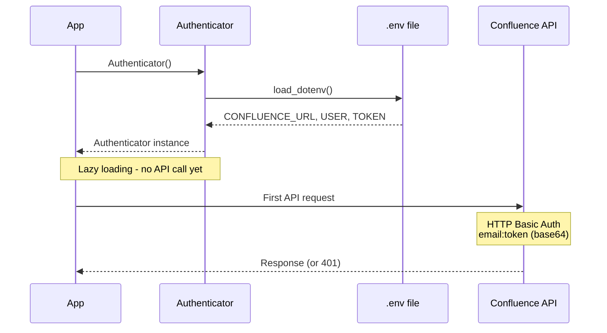

# Cross-Cutting - Security

---

## Authentication

### Credential Management

**Mechanism**: API Token + User Email (HTTP Basic Auth)

| Component | Location | Access |
|-----------|----------|--------|
| Confluence URL | `.env` file | Environment variable |
| User Email | `.env` file | Environment variable |
| API Token | `.env` file | Environment variable |

**Security Measures**:
- `.env` file in `.gitignore` (never committed)
- Credentials loaded via `python-dotenv`
- Never logged or included in error messages
- Never passed as command-line arguments

### Token Generation

```
Atlassian Account Settings
    │
    ▼
Security → API Tokens → Create API Token
    │
    ▼
Copy token to .env file
    │
    ▼
CONFLUENCE_API_TOKEN=ATATT3x...
```

**Token Scope**: Full API access (Atlassian doesn't support scoped tokens)

### Authentication Flow



## Authorization

### Confluence Permission Model

**This library relies on Confluence's native permission system**:

| Permission | Confluence Behavior |
|------------|-------------------|
| View | API returns page content |
| Edit | API allows update_page |
| Create | API allows create_page |
| Delete | API allows delete_page |
| Space Admin | Required for space-level operations |

**Library Behavior**: No additional authorization layer; operations succeed or fail based on Confluence permissions.

### Error Handling for Auth Failures

```python
try:
    page = api.get_page_by_id("12345")
except InvalidCredentialsError as e:
    # 401 Unauthorized
    # e.user = email from .env
    # e.endpoint = Confluence URL
    print(f"Check credentials for {e.user} at {e.endpoint}")
except APIAccessError as e:
    # 403 Forbidden (insufficient permissions)
    print(f"Permission denied: {e}")
```

## Data Protection

### Sensitive Data Handling

| Data Type | Handling |
|-----------|----------|
| API Token | Never logged; never in error messages; .env only |
| User Email | Included in `InvalidCredentialsError` for debugging |
| Page Content | No encryption at rest (Confluence handles storage) |
| Local Files | Future: respect filesystem permissions |

### Logging Security

```python
# NEVER DO THIS:
logger.info(f"Connecting with token: {token}")  # ❌

# CORRECT:
logger.info(f"Connecting as {email} to {url}")  # ✓
logger.debug("API request to /wiki/api/v2/pages/...")  # ✓
```

## Secure Coding Practices

### Subprocess Security

**Rule**: Never use `shell=True`

```python
# CORRECT: No shell, arguments as list
subprocess.run(
    ["pandoc", "-f", "html", "-t", "markdown"],
    input=xhtml,
    capture_output=True,
    text=True,
    timeout=10
)

# NEVER: shell=True is injection risk
subprocess.run(
    f"pandoc -f html -t markdown <<< '{xhtml}'",  # ❌
    shell=True
)
```

### Input Validation

| Input | Validation |
|-------|------------|
| `page_id` | Must be non-empty string (Confluence validates format) |
| `space_key` | Must be non-empty string |
| `title` | Must be non-empty; max 255 chars |
| `xhtml` | Parsed by BeautifulSoup (malformed handled gracefully) |
| `markdown` | Passed to Pandoc (handles arbitrary text) |

### Dependency Security

**Pinned for CVE Mitigations**:

```
requests>=2.32.4  # CVE-2024-35195, CVE-2024-47081
```

**Security Audit**:
```bash
pip-audit  # Check for known vulnerabilities
```

## Compliance Considerations

### Data Residency

- No local storage of page content (in-memory only during operations)
- Future Epic 02: Local files will be user-controlled location
- Confluence data residency is Atlassian's responsibility

### Audit Trail

- Confluence maintains page history (version control)
- This library doesn't add additional audit logging
- Future: Consider optional audit log for sync operations

### GDPR Awareness

- Library doesn't store personal data
- User email only in `.env` file (user's machine)
- Page content may contain PII (Confluence's responsibility)

---
