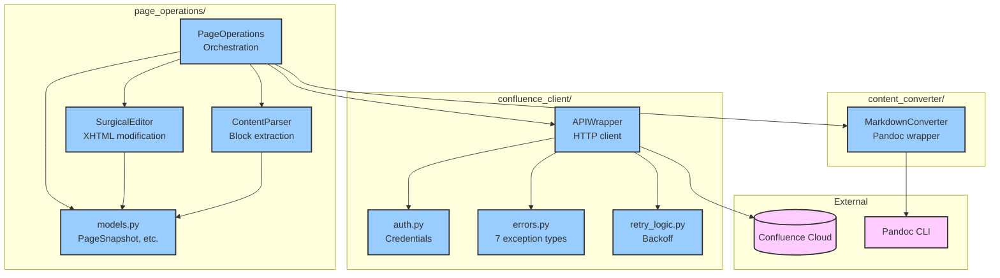
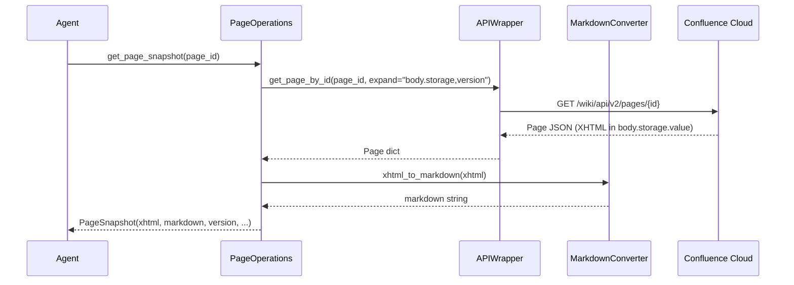
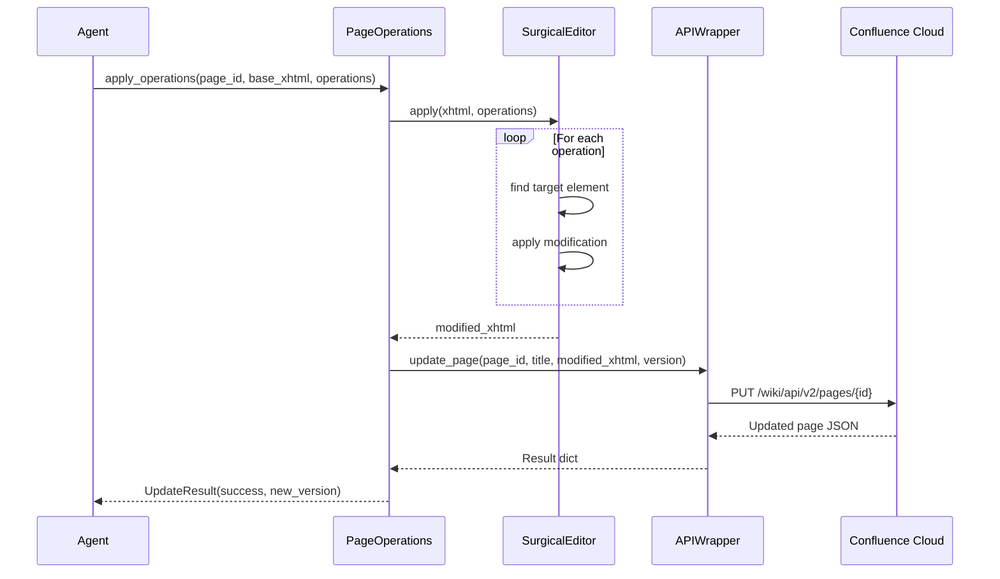
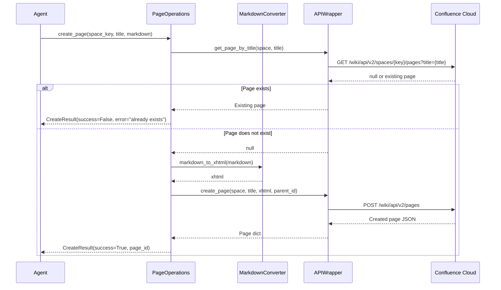

# conf-sync-001: Architecture

---

## Meta: Phase & Agent Information

**BMAD Phase**: Phase 2 - Context-Engineered Development (Architecture Sub-phase)
**Agent Role**: Architect
**Created During**: Architecture Phase - Design Stage
**Prerequisites**: System Context approved, Epic Details, Product Reference

---

## Context Dependencies

**Required Context (must exist before this document)**:
- [conf-sync-001: Epic Details](./details.md) - User stories, scope, success criteria
- Product Reference: Confluence REST API v2 documentation

**Provides Context For (documents that depend on this)**:
- [conf-sync-001: Acceptance Criteria](./acceptance-criteria.md) - Tests validate architecture
- Epic 02, 03, 06: Build on this foundation

---

## Architectural Overview

This epic establishes the foundation architecture for Confluence bidirectional sync:

**Affected Components**: None (new foundation)

**New Components**:
- `confluence_client/` - API layer for Confluence Cloud REST API
- `content_converter/` - Format conversion via Pandoc
- `page_operations/` - High-level orchestration with surgical updates
- `models/` - Shared data structures

## Component Diagrams

### System Context (C4 Level 1)

```
┌─────────────────────────────────────────────────────────────────┐
│                    External Systems                              │
├─────────────────────────────────────────────────────────────────┤
│                                                                  │
│  ┌──────────────────┐         ┌──────────────────┐              │
│  │  Confluence      │         │     Pandoc       │              │
│  │  Cloud API       │         │     CLI          │              │
│  │  (REST v2)       │         │     (3.8.3+)     │              │
│  └────────┬─────────┘         └────────┬─────────┘              │
│           │                            │                         │
│           │ HTTPS                      │ subprocess              │
│           │                            │                         │
│  ┌────────┴────────────────────────────┴─────────┐              │
│  │           confluence-bidir-sync                │              │
│  │                                                │              │
│  │  ┌─────────────────────────────────────────┐  │              │
│  │  │          PageOperations                  │  │              │
│  │  │  (High-level read/write/create)          │  │              │
│  │  └─────────────────────────────────────────┘  │              │
│  │                     │                          │              │
│  │  ┌─────────────────┴───────────────────────┐  │              │
│  │  │                                          │  │              │
│  │  ▼                                          ▼  │              │
│  │  ┌────────────────┐    ┌────────────────┐     │              │
│  │  │ confluence_    │    │ content_       │     │              │
│  │  │ client/        │    │ converter/     │     │              │
│  │  │ (API layer)    │    │ (Pandoc wrap)  │     │              │
│  │  └────────────────┘    └────────────────┘     │              │
│  │                                                │              │
│  └────────────────────────────────────────────────┘              │
│                                                                  │
└─────────────────────────────────────────────────────────────────┘
```

### Component Structure (C4 Level 2)



**Components**:

| Component | Responsibility | Dependencies |
|-----------|---------------|--------------|
| `PageOperations` | High-level API for page read/write/create | APIWrapper, MarkdownConverter, SurgicalEditor |
| `SurgicalEditor` | Apply discrete operations to XHTML | BeautifulSoup, models |
| `ContentParser` | Extract content blocks from XHTML/markdown | BeautifulSoup, models |
| `APIWrapper` | HTTP client with error translation | atlassian-python-api, auth, errors, retry_logic |
| `MarkdownConverter` | Bidirectional XHTML↔markdown | Pandoc subprocess |

## Data Model

### Core Entities

| Entity | Attributes | Purpose |
|--------|-----------|---------|
| `PageSnapshot` | page_id, space_key, title, xhtml, markdown, version, parent_id, labels | Complete page state for updates |
| `SurgicalOperation` | op_type, target_content, new_content, old_level, new_level, row_index | Single operation to apply |
| `ContentBlock` | block_type, content, tag_name, css_selector | Parsed content unit |
| `BlockType` | Enum: HEADING, PARAGRAPH, TABLE, LIST, CODE, MACRO, OTHER | Block classification |
| `UpdateResult` | success, new_version, error | Update operation outcome |
| `CreateResult` | success, page_id, version, error | Create operation outcome |

### Data Classes

```python
@dataclass
class PageSnapshot:
    """Complete page state for update operations."""
    page_id: str
    space_key: str
    title: str
    xhtml: str           # Original XHTML (reference for surgical update)
    markdown: str        # Converted markdown (for agents/diff)
    version: int         # For optimistic locking
    parent_id: Optional[str]
    labels: List[str]

@dataclass
class SurgicalOperation:
    """Single operation to apply to XHTML."""
    op_type: OperationType
    target_content: str      # Content to find/match
    new_content: str         # Replacement content
    old_level: int = 0       # For heading level changes
    new_level: int = 0
    row_index: int = 0       # For table operations

class OperationType(Enum):
    UPDATE_TEXT = "update_text"
    DELETE_BLOCK = "delete_block"
    INSERT_BLOCK = "insert_block"
    CHANGE_HEADING_LEVEL = "change_heading_level"
    TABLE_INSERT_ROW = "table_insert_row"
    TABLE_DELETE_ROW = "table_delete_row"
```

## API Design

### PageOperations Class

```python
class PageOperations:
    """High-level Confluence page operations with surgical update support."""

    def get_page_snapshot(
        self,
        page_id: str,
        version: Optional[int] = None
    ) -> PageSnapshot:
        """Fetch page with both XHTML (reference) and markdown (for agents)."""

    def get_page_versions(
        self,
        page_id: str
    ) -> List[PageVersion]:
        """List available versions for history."""

    def apply_operations(
        self,
        page_id: str,
        base_xhtml: str,
        base_version: int,
        operations: List[SurgicalOperation]
    ) -> UpdateResult:
        """Apply surgical operations to XHTML, upload to Confluence."""

    def create_page(
        self,
        space_key: str,
        title: str,
        markdown_content: str,
        parent_id: Optional[str] = None,
        check_duplicate: bool = True
    ) -> CreateResult:
        """Create new page from markdown content."""
```

### APIWrapper Class

```python
class APIWrapper:
    """Low-level Confluence REST API client with error translation."""

    def get_page_by_id(self, page_id: str, expand: str = "") -> dict
    def get_page_by_title(self, space: str, title: str, expand: str = "") -> Optional[dict]
    def get_child_pages(self, page_id: str, expand: str = "") -> List[dict]
    def create_page(self, space: str, title: str, body: str, parent_id: Optional[str] = None) -> dict
    def update_page(self, page_id: str, title: str, body: str, version: int) -> dict
```

### Error Hierarchy

```
ConfluenceError (base)
  ├── InvalidCredentialsError    # 401 Unauthorized
  ├── PageNotFoundError          # 404 Not Found
  ├── PageAlreadyExistsError     # Duplicate title on create
  ├── VersionConflictError       # 409 Conflict (optimistic locking)
  ├── APIUnreachableError        # Network/timeout errors
  ├── APIAccessError             # Other API failures, rate limit exhaustion
  └── ConversionError            # Pandoc or parsing failures
```

## Integration Points

| Integration | Type | Protocol | Data Flow |
|------------|------|----------|-----------|
| Confluence Cloud | Outbound | HTTPS REST | Page CRUD operations |
| Pandoc CLI | Local | subprocess | stdin/stdout for conversion |

## Sequence Diagrams

### Flow 1: Get Page Snapshot



### Flow 2: Apply Surgical Operations



### Flow 3: Create Page



## Security Considerations

**Authentication**:
- API token stored in `.env` file (not in code/git)
- Loaded via python-dotenv
- Never logged or included in error messages

**Authorization**:
- Relies on Confluence Cloud permissions
- API token must have read/write access to target spaces

**Data Protection**:
- All API calls over HTTPS
- No `shell=True` in subprocess calls (injection prevention)
- Input validation on all user-provided values

**Security Reviews**: Complete - no credentials in logs, secure subprocess handling

## Performance Considerations

**Expected Load**:
- Typical: 1-10 pages per sync operation
- Maximum: 100 pages per space sync

**Performance Targets**:
- Single page fetch: <2s
- Single page update: <3s
- Pandoc conversion: <1s per page

**Optimization Strategies**:
- Minimize API calls per page (use expand parameter)
- Exponential backoff for rate limits
- Content caching in PageSnapshot (avoid re-fetch for update)

## Infrastructure Changes

**New Services**: None (library, not service)

**Configuration Changes**:
- Requires `.env` file with:
  - `CONFLUENCE_URL` - Confluence Cloud instance URL
  - `CONFLUENCE_EMAIL` - User email for authentication
  - `CONFLUENCE_API_TOKEN` - API token

**Resource Requirements**:
- Python 3.9+
- Pandoc 3.8.3+ on system PATH

---
