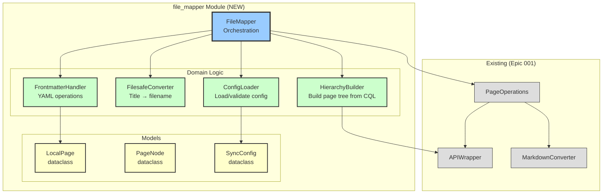
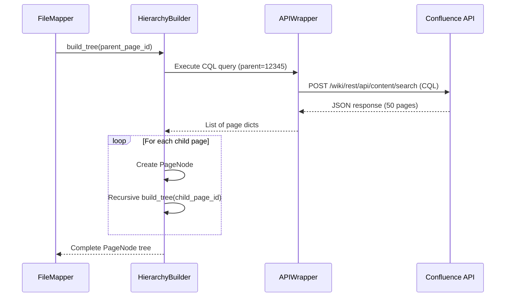
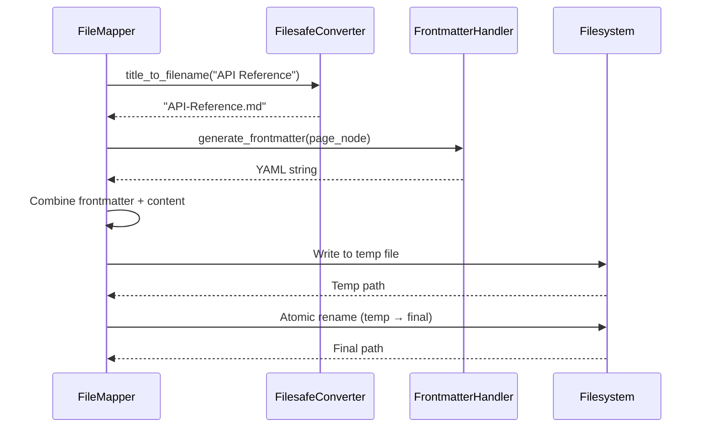
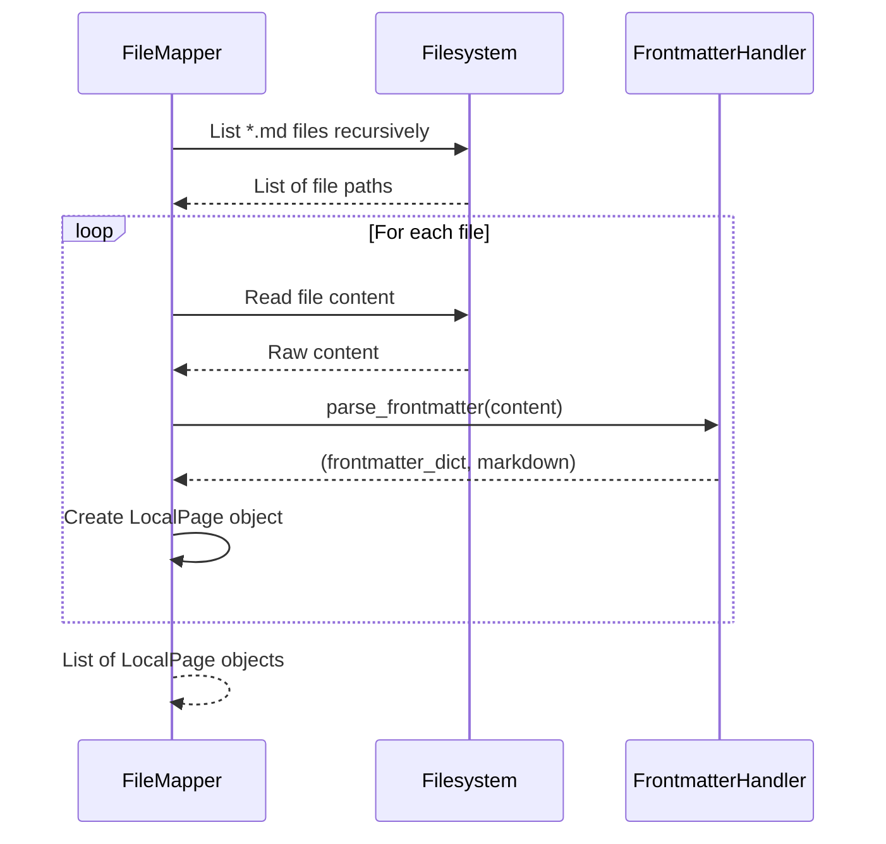

# Architecture - CONF-SYNC-002

---

## Overview

Detailed architecture design for File Structure & Mapping epic.

**Core Responsibility**: Map Confluence page hierarchy to local filesystem, manage frontmatter, handle file operations.

---

## Component Diagram (C4 Level 3)



---

## Component Responsibilities

### FileMapper (Orchestration)

**File**: `src/file_mapper/file_mapper.py`

**Responsibility**: Orchestrate all file operations for sync.

**Public Methods**:
```python
class FileMapper:
    def __init__(self, config: SyncConfig, api_wrapper: APIWrapper):
        """Initialize with config and API client."""

    def discover_pages(self) -> List[PageNode]:
        """Discover pages from Confluence using CQL queries.

        Returns:
            List of PageNode objects representing hierarchy.

        Raises:
            APIAccessError: CQL query failed
            PageLimitExceededError: >100 pages at same level
        """

    def scan_local_files(self) -> List[LocalPage]:
        """Scan local directory for markdown files.

        Returns:
            List of LocalPage objects with parsed frontmatter.

        Raises:
            FilesystemError: Cannot read directory
            FrontmatterError: Invalid YAML in file
        """

    def write_page_to_local(self, page_node: PageNode, content: str) -> Path:
        """Write page content to local file with frontmatter.

        Args:
            page_node: PageNode with metadata
            content: Markdown content (from converter)

        Returns:
            Path to created file

        Raises:
            FilesystemError: Cannot write file
        """

    def read_page_from_local(self, file_path: Path) -> LocalPage:
        """Read local markdown file with frontmatter.

        Args:
            file_path: Path to markdown file

        Returns:
            LocalPage with frontmatter and content

        Raises:
            FilesystemError: Cannot read file
            FrontmatterError: Invalid YAML
        """

    def rename_local_file(self, old_path: Path, new_title: str) -> Path:
        """Rename local file based on new title.

        Args:
            old_path: Current file path
            new_title: New page title from Confluence

        Returns:
            New file path

        Raises:
            FilesystemError: Rename failed
        """
```

---

### HierarchyBuilder (Domain)

**File**: `src/file_mapper/hierarchy_builder.py`

**Responsibility**: Build page tree from CQL queries.

**Public Methods**:
```python
class HierarchyBuilder:
    def __init__(self, api_wrapper: APIWrapper):
        """Initialize with API client."""

    def build_tree(self, parent_page_id: str, space_key: str) -> PageNode:
        """Build complete page hierarchy tree.

        Args:
            parent_page_id: Root page ID
            space_key: Confluence space key

        Returns:
            Root PageNode with children populated recursively

        Raises:
            PageNotFoundError: Parent page doesn't exist
            PageLimitExceededError: >100 pages at same level
            APIAccessError: CQL query failed
        """

    def query_children(self, parent_page_id: str, limit: int = 100) -> List[Dict]:
        """Query child pages using CQL.

        Args:
            parent_page_id: Parent page ID
            limit: Max results (default 100)

        Returns:
            List of dicts with keys: page_id, title, version_when

        Raises:
            PageLimitExceededError: Result count >= limit
            APIAccessError: CQL query failed
        """
```

**CQL Query Format**:
```python
# Query template
cql = f"parent = {parent_page_id}"

# API call (using atlassian-python-api)
results = confluence.cql(
    cql=cql,
    limit=limit,
    expand="version"
)

# Expected response structure
{
    "results": [
        {
            "id": "12345",
            "title": "Page Title",
            "version": {
                "when": "2026-01-30T10:00:00Z",
                "number": 15
            }
        },
        ...
    ],
    "size": 50  # Number of results returned
}
```

---

### FilesafeConverter (Domain)

**File**: `src/file_mapper/filesafe_converter.py`

**Responsibility**: Convert page titles to valid filenames.

**Public Methods**:
```python
class FilesafeConverter:
    @staticmethod
    def title_to_filename(title: str) -> str:
        """Convert Confluence title to filesafe filename.

        Rules:
        - Preserve case
        - Replace colon (:) with double-dash (--)
        - Replace spaces with hyphen (-)
        - Replace forward slash (/) with hyphen (-)
        - Remove or replace other special characters
        - Add .md extension

        Args:
            title: Confluence page title

        Returns:
            Filesafe filename (e.g., "API-Reference--Getting-Started.md")

        Examples:
            "Customer Feedback" → "Customer-Feedback.md"
            "API Reference: Getting Started" → "API-Reference--Getting-Started.md"
            "Q&A Session" → "Q-A-Session.md"
            "2026-01-30 Meeting" → "2026-01-30-Meeting.md"
        """

    @staticmethod
    def is_filesafe_collision(filename1: str, filename2: str) -> bool:
        """Check if two filenames would collide.

        Args:
            filename1: First filename
            filename2: Second filename

        Returns:
            True if filenames are identical (collision)
        """
```

**Implementation Notes**:
```python
def title_to_filename(title: str) -> str:
    # Step 1: Replace colon with double-dash
    result = title.replace(":", "--")

    # Step 2: Replace spaces and slashes with hyphen
    result = result.replace(" ", "-")
    result = result.replace("/", "-")

    # Step 3: Remove/replace other special characters
    # Keep: alphanumeric, hyphen, underscore, period
    safe_chars = set("ABCDEFGHIJKLMNOPQRSTUVWXYZabcdefghijklmnopqrstuvwxyz0123456789-_.")
    result = "".join(c if c in safe_chars else "-" for c in result)

    # Step 4: Collapse multiple hyphens
    while "--" in result and result.count("--") > result.count("--"):
        result = result.replace("---", "--")

    # Step 5: Strip leading/trailing hyphens
    result = result.strip("-")

    # Step 6: Add extension
    return f"{result}.md"
```

---

### FrontmatterHandler (Domain)

**File**: `src/file_mapper/frontmatter_handler.py`

**Responsibility**: Parse and generate YAML frontmatter.

**Public Methods**:
```python
class FrontmatterHandler:
    @staticmethod
    def parse_frontmatter(content: str) -> Tuple[Dict, str]:
        """Parse frontmatter from markdown file.

        Args:
            content: Full markdown file content

        Returns:
            Tuple of (frontmatter_dict, markdown_content)

        Raises:
            FrontmatterError: Invalid YAML syntax
            FrontmatterError: Missing required fields

        Expected format:
            ---
            page_id: "12345"
            space_key: "TEAM"
            title: "Page Title"
            last_synced: "2026-01-30T10:00:00Z"
            confluence_version: 15
            ---

            # Page Title

            Content here...
        """

    @staticmethod
    def generate_frontmatter(page_node: PageNode) -> str:
        """Generate YAML frontmatter for page.

        Args:
            page_node: PageNode with metadata

        Returns:
            YAML frontmatter string (including --- delimiters)

        Example:
            ---
            page_id: "12345"
            space_key: "TEAM"
            title: "Page Title"
            last_synced: "2026-01-30T10:00:00Z"
            confluence_version: 15
            ---
        """

    @staticmethod
    def validate_frontmatter(frontmatter: Dict) -> None:
        """Validate frontmatter has required fields.

        Args:
            frontmatter: Parsed frontmatter dict

        Raises:
            FrontmatterError: Missing required field
            FrontmatterError: Invalid field type

        Required fields:
            - page_id (str)
            - space_key (str)
            - title (str)
        """
```

---

### ConfigLoader (Domain)

**File**: `src/file_mapper/config_loader.py`

**Responsibility**: Load and validate config file.

**Public Methods**:
```python
class ConfigLoader:
    @staticmethod
    def load_config(config_path: Path = Path(".confluence-sync/config.yaml")) -> SyncConfig:
        """Load sync configuration from file.

        Args:
            config_path: Path to config file

        Returns:
            SyncConfig dataclass

        Raises:
            ConfigError: Config file not found
            ConfigError: Invalid YAML
            ConfigError: Missing required fields
        """

    @staticmethod
    def create_default_config(
        space_key: str,
        parent_page_id: str,
        local_path: Path
    ) -> SyncConfig:
        """Create default configuration.

        Args:
            space_key: Confluence space key
            parent_page_id: Root page ID
            local_path: Local directory path

        Returns:
            SyncConfig with sensible defaults
        """

    @staticmethod
    def save_config(config: SyncConfig, config_path: Path) -> None:
        """Save configuration to file.

        Args:
            config: SyncConfig to save
            config_path: Destination path

        Raises:
            FilesystemError: Cannot write file
        """
```

**Config File Format**:
```yaml
# .confluence-sync/config.yaml
version: 1  # Config format version

spaces:
  - space_key: "CONFSYNCTEST"
    parent_page_id: "12345"
    local_path: "./docs/product-docs/"

    # Optional exclusions (MVP: by pageID only)
    exclude:
      - page_id: "67890"  # Archives page

# Future: regex exclusion patterns (Epic 005)
# exclude_patterns:
#   - ".*/[Aa]rchive.*"
```

---

## Data Models

### PageNode (Domain Model)

**File**: `src/file_mapper/models.py`

```python
@dataclass
class PageNode:
    """Represents a page in Confluence hierarchy tree.

    Used for building and traversing page hierarchy during sync.
    """
    page_id: str
    space_key: str
    title: str
    version: int
    last_modified: datetime  # from version.when
    parent_id: Optional[str]
    children: List['PageNode'] = field(default_factory=list)

    def add_child(self, child: 'PageNode') -> None:
        """Add child page to this node."""
        self.children.append(child)

    def is_root(self) -> bool:
        """Check if this is the root node (no parent)."""
        return self.parent_id is None

    def get_depth(self) -> int:
        """Calculate depth in hierarchy (root = 0)."""
        if self.is_root():
            return 0
        # Depth calculation requires parent reference (not shown here)
        return 0  # Placeholder
```

### LocalPage (Domain Model)

```python
@dataclass
class LocalPage:
    """Represents a local markdown file with frontmatter.

    Used for reading and writing local files during sync.
    """
    file_path: Path
    page_id: Optional[str]  # None if new page not yet in Confluence
    space_key: str
    title: str
    content: str  # Markdown content (without frontmatter)
    last_synced: Optional[datetime]
    confluence_version: Optional[int]

    def is_new(self) -> bool:
        """Check if this is a new page (no pageID yet)."""
        return self.page_id is None

    def needs_sync(self, remote_version: int) -> bool:
        """Check if local version differs from remote."""
        if self.confluence_version is None:
            return True
        return self.confluence_version != remote_version
```

### SyncConfig (Domain Model)

```python
@dataclass
class SpaceConfig:
    """Configuration for a single Confluence space."""
    space_key: str
    parent_page_id: str
    local_path: Path
    exclude_page_ids: List[str] = field(default_factory=list)

@dataclass
class SyncConfig:
    """Sync configuration (from .confluence-sync/config.yaml)."""
    version: int  # Config format version
    spaces: List[SpaceConfig]

    def get_space_config(self, space_key: str) -> Optional[SpaceConfig]:
        """Get config for specific space."""
        for space in self.spaces:
            if space.space_key == space_key:
                return space
        return None
```

---

## API Contracts

### FileMapper Public Interface

```python
from dataclasses import dataclass
from pathlib import Path
from typing import List, Optional, Tuple
from datetime import datetime

class FileMapper:
    """Orchestrates file operations for Confluence sync."""

    def __init__(self, config: SyncConfig, api_wrapper: APIWrapper):
        self.config = config
        self.api = api_wrapper
        self.hierarchy_builder = HierarchyBuilder(api_wrapper)
        self.converter = FilesafeConverter()
        self.frontmatter = FrontmatterHandler()

    def discover_pages(self) -> List[PageNode]:
        """Discover pages from Confluence."""
        ...

    def scan_local_files(self) -> List[LocalPage]:
        """Scan local directory for markdown files."""
        ...

    def write_page_to_local(self, page_node: PageNode, content: str) -> Path:
        """Write page to local file."""
        ...

    def read_page_from_local(self, file_path: Path) -> LocalPage:
        """Read page from local file."""
        ...
```

---

## File Organization

```
src/
├── file_mapper/                    # NEW module (Epic 002)
│   ├── __init__.py
│   ├── file_mapper.py             # Orchestration
│   ├── hierarchy_builder.py       # CQL queries, tree building
│   ├── filesafe_converter.py      # Title → filename conversion
│   ├── frontmatter_handler.py     # YAML operations
│   ├── config_loader.py           # Config file management
│   ├── models.py                  # PageNode, LocalPage, SyncConfig
│   └── errors.py                  # FilesystemError, ConfigError, etc.
├── page_operations/                # Existing (Epic 001)
│   └── ...
├── confluence_client/              # Existing (Epic 001)
│   └── ...
└── content_converter/              # Existing (Epic 001)
    └── ...
```

---

## Sequence Diagrams

### Sequence 1: Discover Pages from Confluence



### Sequence 2: Write Page to Local File



### Sequence 3: Scan Local Files



---

## Atomic File Operations Pattern

**Problem**: Multi-file writes can fail mid-operation.

**Solution**: Two-phase commit with temp directory.

```python
class FileMapper:
    def write_pages_atomic(self, pages: List[Tuple[PageNode, str]]) -> None:
        """Write multiple pages atomically (all or nothing).

        Args:
            pages: List of (page_node, content) tuples

        Raises:
            FilesystemError: If any operation fails, rollback all
        """
        temp_dir = Path(".confluence-sync/temp")
        temp_dir.mkdir(exist_ok=True)
        temp_files = []

        try:
            # Phase 1: Write to temp directory
            for page_node, content in pages:
                filename = self.converter.title_to_filename(page_node.title)
                temp_path = temp_dir / filename
                temp_path.write_text(content, encoding="utf-8")
                temp_files.append((temp_path, self._get_final_path(page_node)))

            # Phase 2: Atomic move (all operations succeeded)
            for temp_path, final_path in temp_files:
                final_path.parent.mkdir(parents=True, exist_ok=True)
                os.rename(temp_path, final_path)  # Atomic on POSIX

        except Exception as e:
            # Rollback: delete temp files
            for temp_path, _ in temp_files:
                if temp_path.exists():
                    temp_path.unlink()
            raise FilesystemError(f"Failed to write pages: {e}")
```

---

## Error Handling

### New Exception Types

```python
# src/file_mapper/errors.py

class FilesystemError(ConfluenceError):
    """File I/O operation failed."""
    def __init__(self, path: Path, operation: str, original_error: Exception):
        self.path = path
        self.operation = operation
        self.original_error = original_error
        super().__init__(f"Filesystem error during {operation}: {path}")

class ConfigError(ConfluenceError):
    """Configuration invalid or missing."""
    def __init__(self, config_path: Path, message: str):
        self.config_path = config_path
        super().__init__(f"Config error in {config_path}: {message}")

class FrontmatterError(ConfluenceError):
    """YAML frontmatter invalid."""
    def __init__(self, file_path: Path, line_number: int, yaml_error: str):
        self.file_path = file_path
        self.line_number = line_number
        self.yaml_error = yaml_error
        super().__init__(
            f"Frontmatter error in {file_path} line {line_number}: {yaml_error}"
        )

class PageLimitExceededError(ConfluenceError):
    """CQL query returned >= 100 pages (MVP limit)."""
    def __init__(self, parent_page_id: str, count: int):
        self.parent_page_id = parent_page_id
        self.count = count
        super().__init__(
            f"Parent page {parent_page_id} has >={count} child pages (limit: 100)"
        )
```

---

## Testing Strategy

### Unit Tests

| Component | Test Coverage | Key Tests |
|-----------|---------------|-----------|
| `FilesafeConverter` | 100% | All special char conversions, case preservation |
| `FrontmatterHandler` | 100% | Valid YAML, invalid YAML, missing fields |
| `ConfigLoader` | 100% | Load, validate, save, defaults |
| `HierarchyBuilder` | >90% | CQL queries, tree building, limit enforcement |
| `FileMapper` | >90% | Orchestration, atomic writes, error handling |

### Integration Tests

| Test | Description |
|------|-------------|
| **IT-1: CQL Query** | Execute real CQL query against test space |
| **IT-2: File Operations** | Write/read files with temp directory |
| **IT-3: Config Persistence** | Save and load config file |

### E2E Tests (from AC)

| Test | Description |
|------|-------------|
| **E2E-1: Full Pull** | 15 pages from Confluence → local files |
| **E2E-2: Full Push** | 10 local files → Confluence pages |
| **E2E-3: Title Change** | Rename detection and file rename |

---

## Performance Targets

| Operation | Target | Measurement |
|-----------|--------|-------------|
| CQL query (100 pages) | <5 seconds | Time from request to response |
| Write 100 files | <10 seconds | Including atomic operations |
| Scan 100 local files | <2 seconds | Parse frontmatter, build list |
| Single file write | <100ms | Including frontmatter generation |

---

## Next Steps

After architecture approval:
1. Create ADRs for key decisions
2. Define test strategy
3. Generate technical specs in 13-specs/
