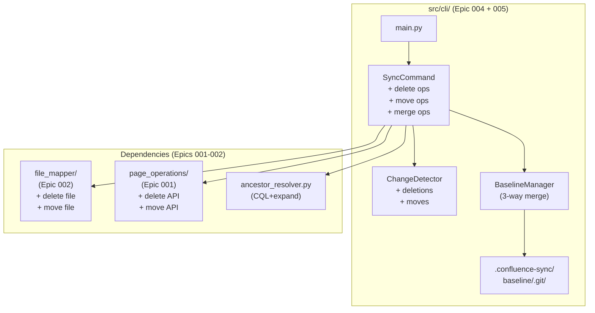
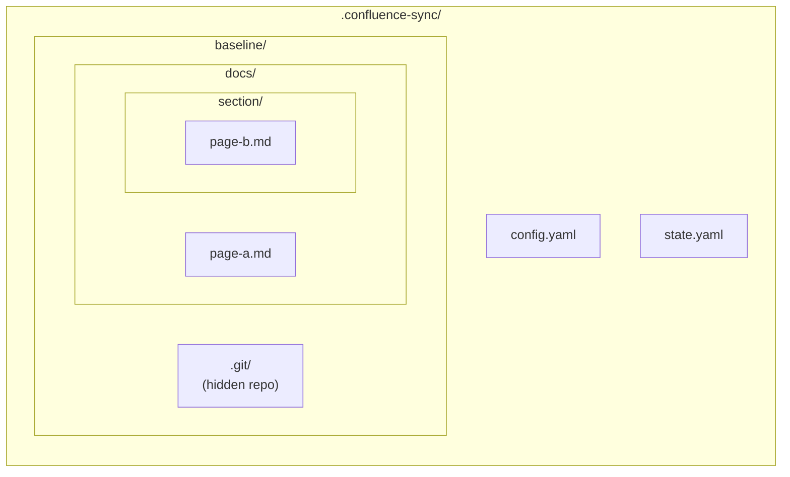
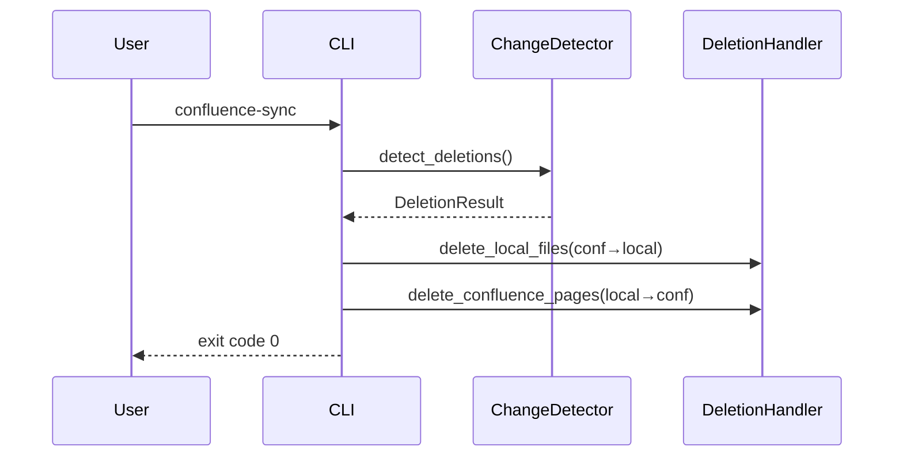
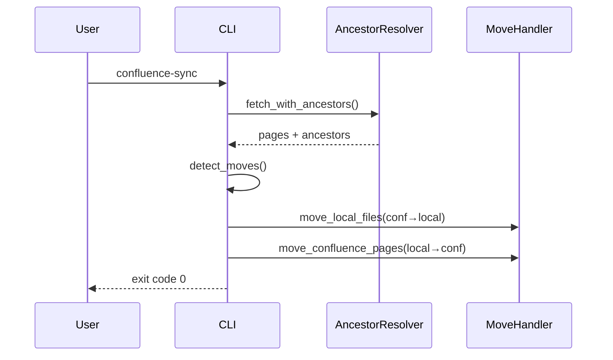
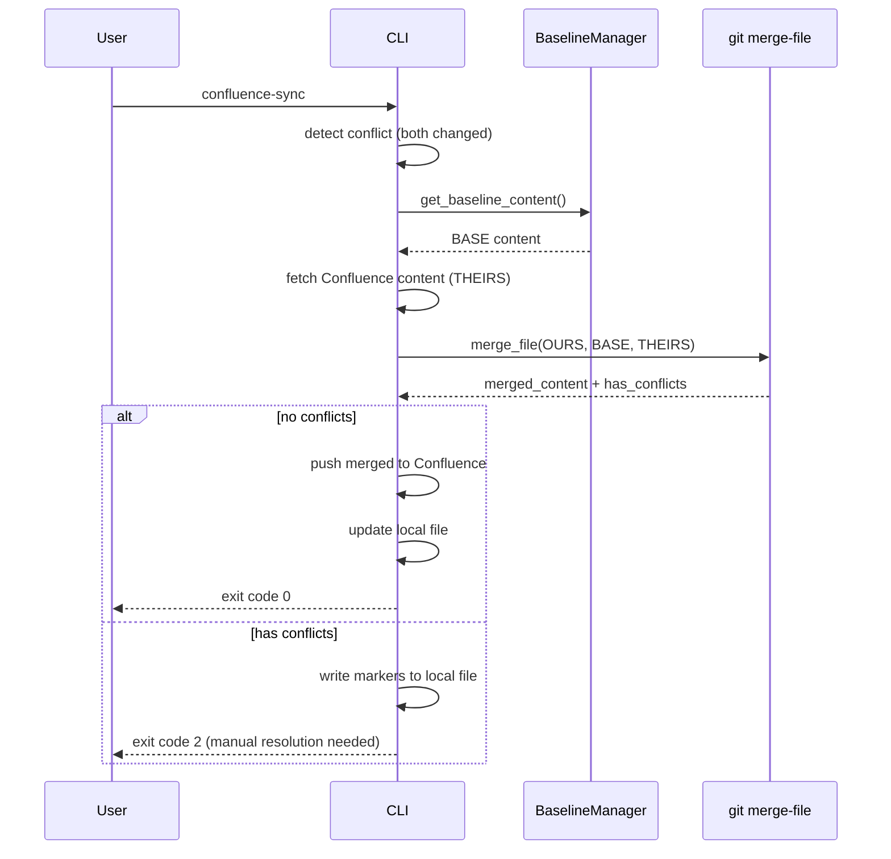
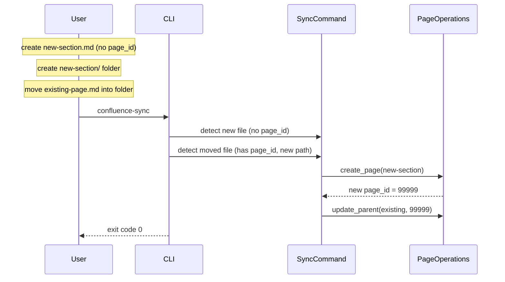
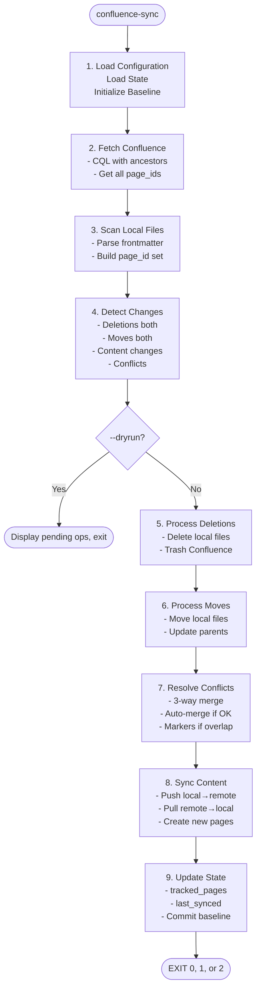

# Architecture - CONF-SYNC-005

---

## Overview

Extends CLI module (Epic 004) with deletion handling, page move detection, and 3-way merge conflict resolution.

**Key Principles**:
- Each page tracked independently by page_id
- Moves detected via CQL ancestors comparison
- Deletions propagate without confirmation (use --dryrun to preview)
- No parent_id in frontmatter; hierarchy from folder structure
- Hidden baseline repo enables auto-merge of non-overlapping changes

---

## Component Diagram



---

## Baseline Repository for 3-Way Merge



**Directory Structure:**
```
.confluence-sync/
├── config.yaml
├── state.yaml
└── baseline/
    ├── .git/           # Hidden git repo (our private baseline)
    └── docs/           # Mirror of synced file structure
        ├── page-a.md   # Content at last successful sync
        └── section/
            └── page-b.md
```

**Purpose**: Store common ancestor for 3-way merge when both local and Confluence change.

**Workflow**:
1. After successful sync → copy synced content to `baseline/`, commit
2. On conflict detection (both sides changed):
   - BASE = `baseline/path/to/file.md`
   - OURS = current local file
   - THEIRS = freshly fetched Confluence content
3. Run `git merge-file` for automatic merge if no overlap
4. If overlap → write conflict markers, require manual resolution

---

## New/Modified Components

### 1. BaselineManager (new: baseline_manager.py)

**Responsibility**: Manage hidden git repo for 3-way merge baselines

```python
class BaselineManager:
    def __init__(self, baseline_path: Path = Path(".confluence-sync/baseline")):
        ...

    def initialize(self) -> None:
        """Create baseline repo if not exists."""
        ...

    def update_baseline(self, files: Dict[Path, str]) -> None:
        """
        Update baseline with synced content.

        Args:
            files: mapping of relative_path → content
        """
        ...

    def get_baseline_content(self, relative_path: Path) -> Optional[str]:
        """Get baseline content for a file, or None if not tracked."""
        ...

    def merge_file(
        self,
        relative_path: Path,
        local_content: str,
        remote_content: str,
    ) -> MergeResult:
        """
        Attempt 3-way merge.

        Returns:
            MergeResult with merged_content and has_conflicts flag
        """
        ...

@dataclass
class MergeResult:
    merged_content: str
    has_conflicts: bool
    conflict_count: int = 0
```

### 2. ChangeDetector Extensions (change_detector.py)

**New Methods**:

```python
class ChangeDetector:
    # Existing from Epic 004
    def detect(self, local_pages, remote_pages) -> ChangeDetectionResult:
        ...

    # NEW: Detect deletions
    def detect_deletions(
        self,
        tracked_page_ids: Set[str],
        local_page_ids: Set[str],
        remote_page_ids: Set[str],
    ) -> DeletionResult:
        """
        Compare tracked pages against current local/remote state.

        Returns:
            deleted_in_confluence: page_ids that exist locally but not in Confluence
            deleted_locally: page_ids that exist in Confluence but not locally
        """
        ...

    # NEW: Detect moves
    def detect_moves(
        self,
        local_pages: List[LocalPage],
        remote_pages: List[PageNode],
    ) -> MoveResult:
        """
        Compare folder paths with Confluence parent hierarchy.

        Requires: remote_pages fetched with expand=ancestors

        Returns:
            moved_in_confluence: pages where Confluence parent differs from local folder
            moved_locally: pages where local folder differs from Confluence parent
        """
        ...
```

### 3. DeletionHandler (new: deletion_handler.py)

**Responsibility**: Execute deletion operations

```python
class DeletionHandler:
    def __init__(
        self,
        file_mapper: FileMapper,
        page_operations: PageOperations,
        output: OutputHandler,
    ):
        ...

    def delete_local_files(
        self,
        deletions: List[DeletionInfo],
        dryrun: bool = False,
    ) -> int:
        """Delete local files for pages deleted in Confluence."""
        ...

    def delete_confluence_pages(
        self,
        deletions: List[DeletionInfo],
        dryrun: bool = False,
    ) -> int:
        """Move Confluence pages to trash for locally deleted files."""
        ...
```

### 4. MoveHandler (new: move_handler.py)

**Responsibility**: Execute move operations

```python
class MoveHandler:
    def __init__(
        self,
        file_mapper: FileMapper,
        page_operations: PageOperations,
        output: OutputHandler,
    ):
        ...

    def move_local_files(
        self,
        moves: List[MoveInfo],
        dryrun: bool = False,
    ) -> int:
        """Move local files to match Confluence hierarchy."""
        ...

    def move_confluence_pages(
        self,
        moves: List[MoveInfo],
        dryrun: bool = False,
    ) -> int:
        """Update Confluence page parents to match local hierarchy."""
        ...

    def resolve_parent_page_id(
        self,
        local_path: Path,
        page_mapping: Dict[Path, str],
    ) -> Optional[str]:
        """Find page_id for parent folder, or None if root."""
        ...
```

### 5. AncestorResolver (new: ancestor_resolver.py)

**Responsibility**: Build and query parent hierarchy from CQL

```python
class AncestorResolver:
    def __init__(self, api_wrapper: ConfluenceAPIWrapper):
        ...

    def fetch_with_ancestors(
        self,
        space_key: str,
        parent_page_id: Optional[str] = None,
    ) -> List[PageNode]:
        """
        Fetch pages with ancestors expansion for move detection.

        CQL: type=page AND space="KEY" AND ancestor=PARENT_ID
        Expand: ancestors
        """
        ...

    def get_parent_chain(self, page: PageNode) -> List[str]:
        """Extract parent page_id chain from ancestors."""
        ...

    def build_path_from_ancestors(
        self,
        page: PageNode,
        page_titles: Dict[str, str],
    ) -> Path:
        """Convert ancestor chain to expected local folder path."""
        ...
```

### 6. ConflictResolver (new: conflict_resolver.py)

**Responsibility**: Orchestrate conflict detection and resolution

```python
class ConflictResolver:
    def __init__(
        self,
        baseline_manager: BaselineManager,
        output: OutputHandler,
    ):
        ...

    def resolve_conflicts(
        self,
        conflicts: List[ConflictInfo],
        dryrun: bool = False,
    ) -> ConflictResolutionResult:
        """
        Attempt to auto-resolve conflicts via 3-way merge.

        For each conflict:
        1. Get baseline content from BaselineManager
        2. Fetch current Confluence content
        3. Attempt git merge-file
        4. If no overlap → return merged content
        5. If overlap → return content with conflict markers
        """
        ...

@dataclass
class ConflictInfo:
    page_id: str
    title: str
    local_path: Path
    local_content: str
    remote_content: str

@dataclass
class ConflictResolutionResult:
    auto_merged: List[str]  # page_ids successfully merged
    manual_required: List[str]  # page_ids with conflict markers
    merge_errors: List[str]  # page_ids that failed to merge
```

---

## File Organization

```
src/
├── cli/                        # Epic 004 + Extensions
│   ├── __init__.py
│   ├── main.py                 # CLI entry point
│   ├── sync_command.py         # + deletion/move/merge orchestration
│   ├── change_detector.py      # + detect_deletions, detect_moves
│   ├── baseline_manager.py     # NEW: 3-way merge baseline handling
│   ├── deletion_handler.py     # NEW: deletion operations
│   ├── move_handler.py         # NEW: move operations
│   ├── ancestor_resolver.py    # NEW: CQL ancestors handling
│   ├── config.py
│   ├── output.py               # + deletion/move/merge output formats
│   ├── models.py               # + DeletionInfo, MoveInfo, MergeResult
│   └── errors.py
├── file_mapper/                # Epic 002
├── page_operations/            # Epic 001 (+ delete, move API calls)
└── ...
```

---

## Data Models

```python
# src/cli/models.py (additions)

@dataclass
class DeletionInfo:
    """Represents a pending deletion."""
    page_id: str
    title: str
    local_path: Optional[Path]
    direction: Literal["confluence_to_local", "local_to_confluence"]

@dataclass
class MoveInfo:
    """Represents a pending move."""
    page_id: str
    title: str
    old_path: Path
    new_path: Path
    new_parent_id: Optional[str]  # None = root
    direction: Literal["confluence_to_local", "local_to_confluence"]

@dataclass
class DeletionResult:
    """Result of deletion detection."""
    deleted_in_confluence: List[DeletionInfo] = field(default_factory=list)
    deleted_locally: List[DeletionInfo] = field(default_factory=list)

@dataclass
class MoveResult:
    """Result of move detection."""
    moved_in_confluence: List[MoveInfo] = field(default_factory=list)
    moved_locally: List[MoveInfo] = field(default_factory=list)
    conflicts: List[MoveInfo] = field(default_factory=list)  # target exists

@dataclass
class MergeResult:
    """Result of 3-way merge attempt."""
    merged_content: str
    has_conflicts: bool
    conflict_count: int = 0

@dataclass
class ConflictInfo:
    """Information about a content conflict."""
    page_id: str
    title: str
    local_path: Path
    local_content: str
    remote_content: str
    baseline_content: Optional[str]  # None if new file

@dataclass
class ConflictResolutionResult:
    """Result of conflict resolution phase."""
    auto_merged: List[str] = field(default_factory=list)  # page_ids
    manual_required: List[str] = field(default_factory=list)
    merge_errors: List[str] = field(default_factory=list)
```

---

## Sequence Diagrams

### Sequence 1: Sync with Deletions



### Sequence 2: Sync with Moves



### Sequence 3: 3-Way Merge Conflict Resolution (AC-3)



### Sequence 4: Create Parent and Move Child (AC-5.6)



---

## Complete Sync Flow (Epic 004 + 005)



---

## CQL Query for Ancestors

```python
# Fetch pages with ancestors for move detection
def fetch_with_ancestors(self, space_key: str, parent_page_id: Optional[str]) -> List[dict]:
    if parent_page_id:
        cql = f'type=page AND space="{space_key}" AND ancestor={parent_page_id}'
    else:
        cql = f'type=page AND space="{space_key}"'

    # CRITICAL: expand=ancestors to get parent chain
    response = self.api.search(
        cql=cql,
        expand="ancestors",
        limit=500,
    )
    return response["results"]
```

**Response structure with ancestors**:
```json
{
  "id": "12345",
  "title": "Child Page",
  "ancestors": [
    {"id": "11111", "title": "Root"},
    {"id": "22222", "title": "Parent Section"}
  ]
}
```

---

## State Tracking Extensions

### .confluence-sync/state.yaml

```yaml
last_synced: "2026-01-31T10:00:00Z"

# Track page_ids for deletion detection
tracked_pages:
  - page_id: "12345"
    local_path: "docs/getting-started.md"
  - page_id: "67890"
    local_path: "docs/api/overview.md"
```

**Note**: `tracked_pages` enables detection of local deletions (file removed but page_id was known).

---

## Error Handling Extensions

| Error | Exit Code | Handling |
|-------|-----------|----------|
| Delete permission denied | 1 | Log error, continue with others |
| Move target exists | 1 | Log conflict, skip this page |
| Parent page not found | 1 | Log error, skip move |
| CQL query timeout | 4 | Retry with backoff |

---

## API Calls Required

### Delete Page (Confluence REST API v2)

```
DELETE /wiki/api/v2/pages/{page_id}
```

Moves page to trash (recoverable via UI).

### Move Page (Update Parent)

```
PUT /wiki/api/v2/pages/{page_id}
Content-Type: application/json

{
  "id": "12345",
  "version": { "number": N+1 },
  "parentId": "67890"
}
```

---

## Performance Considerations

| Operation | Consideration |
|-----------|---------------|
| Ancestors query | One CQL call with expand=ancestors vs N individual calls |
| Batch deletions | Group API calls, handle partial failures |
| State file update | Atomic write (temp file + rename) |
| Move detection | O(n) comparison of local paths vs ancestors |

---

## Integration Points

### With Epic 001 (page_operations)
- Add `delete_page(page_id)` method
- Add `update_page_parent(page_id, new_parent_id)` method

### With Epic 002 (file_mapper)
- Use existing `delete_local_file()` if available
- Use existing `move_local_file()` if available
- Otherwise add as utility methods

### With Epic 004 (cli)
- Extend `SyncCommand.execute()` with deletion/move phases
- Extend `ChangeDetector` with new detection methods
- Extend `OutputHandler` with deletion/move message formats
